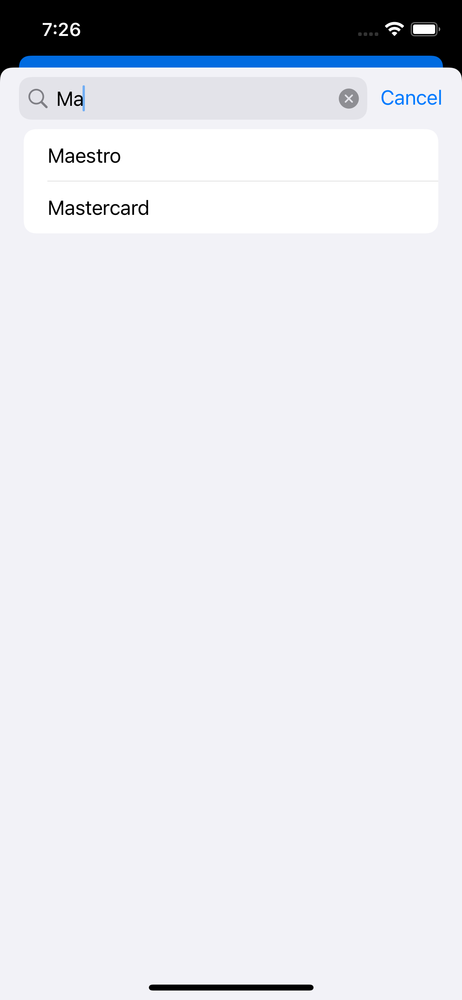

## Task Details

This challenge is to create a payment type selection interface using SwiftUI.
It should:
- ⏱️ 60-second countdown timer
- 💳 Payment method selection
- 🔍 Search functionality for payment types
- ♻️ Pull-to-refresh payment list
- ✅ Selection state management
- 🎯 Modal presentation
- ✨ Success view after completion

---

## Setup

### Open the project in Xcode

```bash
open SwiftUIChallenge.xcodeproj
```

### Running the Project

1. Open the project in Xcode
2. Select your target device (iOS Simulator or physical device)
3. Click the "Run" button (▶️) or press `Cmd + R` to build and run the project

### Project Structure
The application's entry point is `SwiftUIChallengeApp.swift`, which loads the main `ContentView`. The core functionality is organized as follows:
- `SwiftUIChallengeApp.swift`: Application entry point and setup
- `ContentView.swift`: Main view implementation
- `PaymentTypesRepositoryImplementation.swift`: Data layer implementation


### Running Project Example

Screenshots of the full flow are in the `Screenshots` folder.

Example:


---
